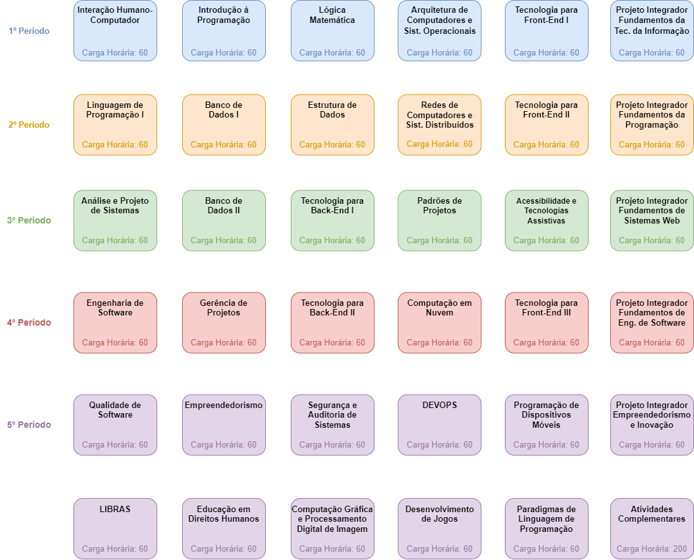

# Grade Curricular

A grade curricular é um documento que mostra quais são as disciplinas oferecidas ao longo da graduação, bem como a carga horárias destinada para cada uma delas. Em linhas gerais, as disciplinas de uma grade curricular podem ser separadas em três tipos:

- **Obrigatórias:** são aquelas consideradas essenciais para a formação do profissional, por isso, os alunos devem ser obrigatoriamente cursá-las.
- **Eletivas:** são aquela que os alunos podem escolher cursar ou não entre uma ampla opção, com a exigência de que uma determinada carga horária seja cumprida.
- **Optativas:** são aquelas consideradas complementares; os estudantes não são obrigados a cumpri-las, no entanto, são interessantes porque complementam a formação.

Para facilitar a visualização da grade curricular, construímos uma imagem com as disciplinas ofertadas no curso de Sistemas para Internet. Nos esquemas abaixo, cada linha representa um período. No curso de Sistemas para Internet não existem pré-requisitos, entretanto, é importante destacar que existe uma continuidade entre algumas cadeiras. As disciplinas não são ofertadas em todos os períodos, sendo necessário verificar junto à Coordenação dos cursos de Tecnologia da Informação. As disciplinas que estão disponíveis no semestre atual podem ser conferidas no período de matrícula.

### Sistemas Para Internet

Para mais informações osbre o curso de Sistemas para Internet, consulte o [site da UNIESP Centro Universitário](https://www.iesp.edu.br/).
